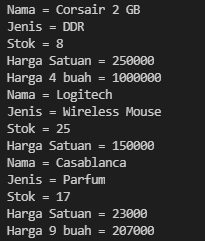
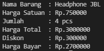

 # LAPORAN PRAKTIKUM PERTEMUAN 3

## Sub bab 2.2 
1.) Karakteristik Class yaitu  Class merupakan tempat untuk membuat objek. Didalam class akan dideklarasikan variabel atau atribut dan method yang dalam istilah prosedural dikenal dengan fungsi atau prosedur. Proses pembuatan objek dari sebuah class disebut dengan instantiation (Instansiasi). Sedangkan Karakteristik Object yaitu memiliki status(state) dan memiliki tingkah laku (Behavior). Status didalam pemrograman itu dikenal dengan istilah atribut atau variabel. Tingkah laku (Behavior) merupakan fungsi atau prosedur yang didalam konsep OOP dikenal dengan method. <p>
2.) Kata kunci yang digunakan untuk mendeklarasikan class yaitu kata kunci "class" <p> 
3.) Ada 4 atribut yaitu namaBarang, jenisBarang, stok dan hargaSatuan. Atribut tersebut berada pada baris ke 13 dan 14
<p>4.) Ada 4 method yaitu tampilBarang, tambahStok, kurangiStok dan hitungHargaTotal. Method tersebut berada di baris ke 16, 23, 27 dan 31. <p>
5.) Code program :

```
void kurangiStok(int n){    
if(n>0){
     stok=stok-n; 
}else{}
```
6.) Karena untuk mengembalikan nilai n jika sudah didapat nilainya.<p>
7.) untuk mengembalikan nilai ke integer.<p>
8.) Karena tidak ada yang dikembalikan atau di return kan.

## Sub bab 2.3 
1.)  Proses instansiasi dilakukan pada baris ke 15 dan nama objek yang dihasilkan yaitu b1.<p>
2.) Dengan cara memanggil nama objek yang telah di instansiasi lalu diketik atribut atau methodnya.

## Sub bab 2.4
1.)  Deklarasi
konstruktor berparameter dilakukan pada baris ke 18<p>
2.) Yang dilakukan pada program tersebut yaitu instansiasi konstruktor yang memiliki 4 parameter  dengan objek baru dengan bernama b2.<p>
3.) Code program :
```
barang b3 = new barang("Casablanca", "Parfum" , 17, 23000);
b3.tampilBarang();
int hargaTotal2= b3.totalHarga(9);
System.out.println("Harga 9 buah = "+ hargaTotal2);
```
Output :
<p> 


## Sub bab 2.5 Latihan Praktikum

1.) Code program :
```
public class tugas1 {
    String namaBarang;
    int hargaSatuan, jumlah;

    int hitungHargaTotal(int a,int b){
        int total = a * b;
        return total;
    }

    int hitungDiskon(int n){
        int dis = 0;
        if (n > 100000){
            dis = n * 10/100;
        }else if ((n > 50000) && (n < 100000)){
            dis = n * 5/100;
        }else {
            dis = 0;
        }
        return dis;
    }

    int hitungHargaBayar(int p,int q){
        int totalHarga = 0;

        totalHarga = p - q;

        return totalHarga;

    }
}

public class tugas1Main{
    public static void main(String[] args){
        tugas1 barang = new tugas1();
        barang.namaBarang = "Headphone JBL";
        barang.hargaSatuan = 750000;
        barang.jumlah = 4;

        System.out.println("Nama Barang  : " + barang.namaBarang);
        System.out.println("Harga Satuan : Rp." + barang.hargaSatuan);
        System.out.println("Jumlah       : " + barang.jumlah +" pcs");
        System.out.println("Harga Total  : Rp." + barang.hitungHargaTotal(barang.hargaSatuan, barang.jumlah));
        System.out.println("Diskon       : Rp." + barang.hitungDiskon(barang.hitungHargaTotal(barang.hargaSatuan, barang.jumlah)));
        System.out.println("Harga Bayar  : Rp." + barang.hitungHargaBayar(barang.hitungHargaTotal(barang.hargaSatuan, barang.jumlah), barang.hitungDiskon(barang.hitungHargaTotal(barang.hargaSatuan, barang.jumlah))));
    }
}
```
Output :
<p>

2.) Code Program :
```
public class Pacman{
int x, y, width, height;

    void moveLeft(int n) {
        x -= 1;
    }

    void moveRight(int n) {
        x += 1;
    }

    void moveUp(int n) {
        y += 1;
    }

    void moveDown(int n) {
        y -= 1;
    }

    void printPosition(int n, int o) {
        System.out.println("\nPacman pada posisi (x,y) = (" + x + "," + y + ")");
    }
}


import java.util.Scanner;

public class PacmanMain {
    public static void main(String[] args) {
        Pacman pac = new Pacman();
        Scanner sc = new Scanner(System.in);
        pac.x = 0;
        pac.y = 0;

        System.out.print("Masukkan batas x = ");
        pac.width = sc.nextInt();
        System.out.print("Masukkan batas y = ");
        pac.height = sc.nextInt();

        for (;;) {
            System.out.print(
                "\nPilih action : \n1.Move Left\n2.Move Right\n3.Move Up\n4.Move Down\n5.Exit\nJawaban anda = ");
            int inputPosisi = sc.nextInt();
            if (pac.x == 0 && inputPosisi == 1) {
                System.out.println("\nPacman melebihi batas");
                pac.printPosition(pac.x, pac.y);
                continue;
            } else if (pac.y == 0 && inputPosisi == 4) {
                System.out.println("\nPacman melebihi batas");
                pac.printPosition(pac.x, pac.y);
                continue;
            } else if (pac.x == pac.width && inputPosisi == 2) {
                System.out.println("\nPacman melebihi batas");
                pac.printPosition(pac.x, pac.y);
                continue;
            } else if (pac.y == pac.height && inputPosisi == 3) {
                System.out.println("\nPacman melebihi batas");
                pac.printPosition(pac.x, pac.y);
                continue;
            }

            if (inputPosisi == 1) {
                pac.moveLeft(pac.x);
                pac.printPosition(pac.x, pac.y);
            } else if (inputPosisi == 2) {
                pac.moveRight(pac.x);
                pac.printPosition(pac.x, pac.y);
            } else if (inputPosisi == 3) {
                pac.moveUp(pac.y);
                pac.printPosition(pac.x, pac.y);
            } else if (inputPosisi == 4) {
                pac.moveDown(pac.y);
                pac.printPosition(pac.x, pac.y);
            } else {
                System.out.println("\nTERIMA KASIH\n");
                break;
            }

        }

    }
}
```
Output : 
<p><image src = "03.PNG">
<image src = "04.PNG">
<image src = "05.PNG">
<image src = "06.PNG">
<image src = "07.PNG">
<image src = "08.PNG"><P>
<image src = "09.PNG">