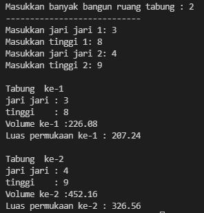

   # LAPORAN PRAKTIKUM PERTEMUAN 3 

## Subbab 3.2 
1.) Tidak, class yang akan dibuat array of object hanya harus memiliki atribut dan tidak harus memiliki method juga.<p> 
2.) Tidak, karena untuk membuat objek persegiPanjang index array ke-1  <p> 
3.) untuk menginstansiasi objek persegiPanjang dengan nama ppArray berjumlah 3 array <p> 
4.) kode tersebut membuat array indeks ke-1 yang dilakukan input panjang, dan lebar.  <p> 
5.) Karena agar mudah membedakan antara class main dan class bukan main <p>
## Subbab 3.3
1.) Bisa <p> 
2.) Code program:
```
mahasiswa[][] mhs = new mahasiswa [2][2];
mhs[0][0] = new mahasiswa();
```
<p> 
3.) Karena belum membuat objek ppArray pada indeks array ke-5, jadi harus ditambahkan sebelum instansiasi objek:<p> 

```
ppArray[5] = new Persegi();
```
<p> 
4.) Code Program :

```
System.out.println("Masukkan batas array : );
int lengthArray = sc.nextInt();
PersegiPanjang[] ppArray = new PersegiPanjang[lengthArray];
```
<p>
5.) Boleh, akan tetapi program tersebut menjadi tidak efisien atau terlalu panjang.
<p> 

## Subbab 3.4
1.) Bisa, contohnya:
``` 
public class buku{
    int jumlah, harga;
    public buku(){

    }
    public buku(int a, int b){
    jumlah = a;
    harga = b;
  }
}
```
<p>
2.) Code program:

```
public class Segitiga{
    public int alas;
    public int tinggi;
    
    public Segitiga(int x, int y){
        alas = x;
        tinggi = y;
    }
}
```
<p>
3.) Code program: 

```
public class Segitiga{
    public int alas;
    public int tinggi;
    
    public Segitiga(int a, int t){
        alas = a;
        tinggi = t;
    }

    int hitungLuas(){
        int luas = (alas*tinggi)/2;
        return luas;
    }

    double hitungKeliling(){
        double keliling = (((alas*0.5)*(alas*0.5))+(tinggi*tinggi))*2+alas;
        return keliling;
    }
}
```
<p>
4.) Code program: 

```
public class segitigaMain{
    public static void main(String[] args){
        Segitiga[] sgArray = new Segitiga[4];
        for(int i = 0 ; i < sgArray.length ; i++){
            sgArray[i] = new Segitiga();
        }
             sgArray[0].alas = 10;
             sgArray[0].tinggi = 4;
             sgArray[1].alas = 20;
             sgArray[1].tinggi = 10;
             sgArray[2].alas = 15;
             sgArray[2].tinggi = 6;
             sgArray[3].alas = 25;
             sgArray[3].tinggi = 10;
    }
}
```
<p>
5.) Code Program : 

```
 public class segitigaMain{
         public static void main(String[] args){
             Segitiga[] sgArray = new Segitiga[4];
             for (int i = 0 ; i < sgArray.length ; i++){
                 sgArray[i] = new Segitiga();
             }
    sgArray[0].alas = 10;
    sgArray[0].tinggi = 4;
    sgArray[1].alas = 20;
    sgArray[1].tinggi = 10;
    sgArray[2].alas = 15;
    sgArray[2].tinggi = 6;
    sgArray[3].alas = 25;
    sgArray[3].tinggi = 10;

    for (int i = 0 ; i < sgArray.length ; i++){
    System.out.println("Luas Segitiga ke - " + (i+1) + " adalah : " + sgArray[i].hitungLuas());
    System.out.println("Keliling Segitiga ke - " + (i+1) + " adalah : " + sgArray[i].hitungKeliling());
        }
    }
}
```
<p>

## Latihan Praktikum 
1.) Buatlah program yang dapat menghitung luas permukaan dan volume beberapa bangun ruang
(minimal 3, jenis bangun luas bebas). Buatlah 3 (tiga) class sesuai dengan jumlah jenis bangun
ruang. Dan buat satu main class untuk membuat array of objek yang menginputkan atribut-atribut
yang ada menggunakan konstruktor semua bangun ruang tersebut.
Keterangan : Buat looping untuk menginputkan masing-masing atributnya, kemudian tampilkan
luas permukaan dan volume dari tiap jenis bangun ruang tersebut.

### Jawab : 
Code Program: 
```java
package code;

public class setengahBola{
	int jari; 
	
	public setengahBola(int r){
		jari = r;
	}
	
	public double volume(){
		return 0.67*3.14*(jari*jari*jari);
	}
	
	public double luasPermukaan(){
		return 3.14*2*(jari*jari);
	}
}

public class setengahBolaPejal {
    public int jari;

    public setengahBolaPejal(int r){
        jari = r; 
    }

    public double volume(){
        return 0.67*3.14*(jari*jari*jari);
    }
    
    public double luasPermukaan() {
        return 3*3.14*(jari*jari);
    }
}

public class tabung {
    public int jari, tinggi;
    
    public tabung(int r, int t){
        jari = r; 
        tinggi = t;
    }
    public double volume(){
        return 3.14*(jari*jari)*tinggi;
    }
    public double luasPermukaan(){
        return 2*3.14*jari*(jari+tinggi);
    }
}

import java.util.Scanner;

public class bangunRuang {
    public static void main (String[] args){
        Scanner sc = new Scanner(System.in);

        System.out.print("Masukkan banyak bangun ruang setengah bola : ");
        int setBol = sc.nextInt();
        int r;
        setengahBola[] brSetBola = new setengahBola[setBol];
        System.out.println("----------------------------");
        for(int i = 0 ; i < brSetBola.length; i++){
            System.out.print("Masukkan jari jari "+(i+1)+ ": ");
            r = sc.nextInt();
            brSetBola[i]= new setengahBola(r);  
        }
        for (int i = 0 ; i <brSetBola.length; i++){
            System.out.println();
            System.out.println("Setengah Bola ke-" + (i+1));
            System.out.println("jari jari ke-" +(i+1)+": " + brSetBola[i].jari);
            System.out.println("Volume ke-"+(i+1)+" :" + brSetBola[i].volume());
            System.out.println("Luas permukaan ke-" + (i+1) + " : " + brSetBola[i].luasPermukaan());

        }

        System.out.print("Masukkan banyak bangun ruang setengah bola pejal : ");
        int setBolPejal = sc.nextInt();
        int r2;
        setengahBolaPejal[] brSetBolaPejal = new setengahBolaPejal[setBolPejal];
        System.out.println("----------------------------");
        for(int i = 0 ; i < brSetBolaPejal.length; i++){
            System.out.print("Masukkan jari jari "+(i+1)+ ": ");
            r2 = sc.nextInt();
            brSetBolaPejal[i]= new setengahBolaPejal(r2);  
        }
        for (int i = 0 ; i <brSetBolaPejal.length; i++){
            System.out.println();
            System.out.println("Setengah Bola Pejal ke-" + (i+1));
            System.out.println("jari jari : " + brSetBolaPejal[i].jari);
            System.out.println("Volume ke-"+ (i+1) +" :" + brSetBolaPejal[i].volume());
            System.out.println("Luas permukaan ke-" + (i+1) + " : " + brSetBolaPejal[i].luasPermukaan());

        }

        System.out.print("Masukkan banyak bangun ruang tabung : ");
        int tbg = sc.nextInt();
        int r3,t;
        tabung[] tabungAr = new tabung[tbg];
        System.out.println("----------------------------");
        for(int i = 0 ; i < tabungAr.length; i++){
            System.out.print("Masukkan jari jari "+(i+1)+ ": ");
            r3 = sc.nextInt();
            System.out.print("Masukkan tinggi "+(i+1)+ ": ");
            t = sc.nextInt();
            tabungAr[i]= new tabung(r3, t);  
        }
        for (int i = 0 ; i <tabungAr.length; i++){
            System.out.println();
            System.out.println("Tabung  ke-" + (i+1));
            System.out.println("jari jari : " + tabungAr[i].jari);
            System.out.println("tinggi    : " + tabungAr[i].tinggi);
            System.out.println("Volume ke-"+(i+1)+" :" + tabungAr[i].volume());
            System.out.println("Luas permukaan ke-" + (i+1) + " : " + tabungAr[i].luasPermukaan());

        }
    }
    
}


```

Output Program : 
<p>


2.) Sebuah perusahaan jual beli tanah membutuhkan sebuah program yang dapat memberitahu luas
tanah. Program tersebut dapat menerima input jumlah tanah yang akan dihitung dan atribut
Algoritma dan Struktur Data 2021-2022
6 Tim Ajar Algoritma dan Struktur Data 2021-2022
Jurusan Teknologi Informasi-Politeknik Negeri Malang
panjang dan lebar masing-masing dari tanah yang diinputkan. Program dapat menampilkan luas
tanah masing-masing tanah yang diinputkan tadi dan juga tanah terluas dari ketiga tanah yang
ada. Contoh Output program : <p>Jumlah tanah: 3 <p>Tanah 1 <p>Panjang: 100 <p>Lebar: 40 <p>Tanah 2 <p>Panjang: 250 <p>Lebar: 100 <p>Tanah 3 <p>Panjang: 120 <p>Lebar: 100 <p>Luas Tanah 1: 4000 <p>Luas Tanah 2: 25000 <p>Luas Tanah 3: 12000
<p>Tanah terluas: Tanah 2

### Jawab: 
Code Program :<p> 
```java
package code;

public class jualBeliTanah {
    int panjang, lebar;
	
	int luasTanah(){
		return panjang*lebar;
	}
	
	int tanahTerluas(int luas[]){
		int terluas = 0;
		int x = 0;
		for(int i = 0; i < luas.length; i++){
			if(luas[i] > terluas){
				terluas = luas[i];
				x = i;
			}
		}
		return x;
	}
}

import java.util.Scanner;

public class tanahMain {
    public static void main(String[] args){
		Scanner sc = new Scanner(System.in);
		System.out.print("Masukkan jumlah tanah : ");
		int t = sc.nextInt();
		jualBeliTanah[] tanahArray = new jualBeliTanah[t];
		System.out.println();
		for(int i = 0; i < t; i++){
			tanahArray[i] = new jualBeliTanah();
			System.out.println("Tanah " + (i+1)); 
			System.out.print("Panjang : ");
			tanahArray[i].panjang = sc.nextInt();
			System.out.print("Lebar : ");
			tanahArray[i].lebar = sc.nextInt();
		}
		System.out.println();
		for(int i = 0; i < t; i++){
			System.out.println("Luas tanah " +(i+1)+" : " + tanahArray[i].luasTanah());
		}
		System.out.println();
		int y = 0; 
		int luas[] = new int[t];
		for (int i = 0; i < t; i++){
			luas[i] = tanahArray[i].luasTanah();
		}
		y = tanahArray[0].tanahTerluas(luas);
		System.out.println("Tanah terluas : Tanah " + (y+1));
	}
}  
```

Output program : <p>


3.) Sebuah kampus membutuhkan program untuk menampilkan informasi mahasiswa berupa nama,
nim, jenis kelamin dan juga IPK mahasiswa. Program dapat menerima input semua informasi
tersebut, kemudian menampilkanya kembali ke user. Implementasikan program tersebut jika
dimisalkan terdapat 3 data mahasiswa yang tersedia. Contoh output program: 
<p>

### Jawab : 
Code program:
```java
package code;

import java.util.Scanner;

public class mahasiswa {
    Scanner sc = new Scanner(System.in);
    String nama;
    int nim;
    char jenisKelamin;
    double nilaiIPK;

    void display() {
        System.out.println("nama : " + nama);
        System.out.println("nim : " + nim);
        System.out.println("Jenis kelamin : " + jenisKelamin);
        System.out.println("Nilai IPK : " + nilaiIPK);
    }

    void input() {
        System.out.print("Masukkan nama : ");
        nama = sc.nextLine();
        System.out.print("Masukkan nim : ");
        nim = sc.nextInt();
        System.out.print("Masukkan jenis kelamin : ");
        jenisKelamin = sc.next().charAt(0);
        System.out.print("Masukkan Nilai IPK : ");
        nilaiIPK = sc.nextDouble();
    }
}

import java.util.Scanner;

public class mahasiswaMain {
    public static void main(String[] args){
        mahasiswa[] mhAr = new mahasiswa[3];

        //input data
        for (int i=0; i<mhAr.length; i++) {
            mhAr[i] = new mahasiswa();
            System.out.println("Masukkan data mahasiswa ke-" + (i+1));
            mhAr[i].input();
            System.out.println();
        }
        System.out.println();

        //output
        for (int i=0; i<mhAr.length; i++) {
            System.out.println("Data Mahasiswa ke-" + (i+1));
            mhAr[i].display();
        }
    }
}
```
Output : 
<p>